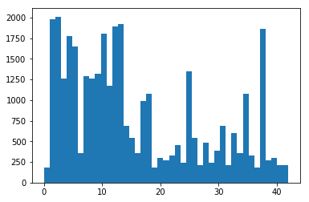
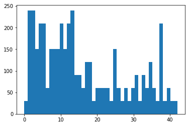
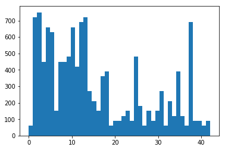

### Traffic Sign Recognition Writeup ###

---

**Build a Traffic Sign Recognition Project**

The goals / steps of this project are the following:
* Load the data set (see below for links to the project data set)
* Explore, summarize and visualize the data set
* Design, train and test a model architecture
* Use the model to make predictions on new images
* Analyze the softmax probabilities of the new images
* Summarize the results with a written report

## Rubric Points
###### Here I will consider the [rubric points](https://review.udacity.com/#!/rubrics/481/view) individually and describe how I addressed each point in my implementation.

---
### Writeup / README
##### 1. Provide a Writeup / README that includes all the rubric points and how you addressed each one. You can submit your writeup as markdown or pdf. You can use this template as a guide for writing the report. The submission includes the project code.

Here is a link to my [project code](https://github.com/knasim/traffic-sign-classifier/blob/master/Traffic_Sign_Classifier.ipynb)

### Data Set Summary & Exploration

#### 1. Basic summary of the data set

##### 1. Provide a basic summary of the data set. In the code, the analysis should be done using python, numpy and/or pandas methods rather than hardcoding results manually.

Native Python methods were used to retrieve the number of samples and their size::

* The size of training set is 34799
* The size of the validation set is 4410
* The size of test set is 12630
* The shape of a traffic sign image is (32, 32, 3)
* The number of unique classes/labels in the data   
  set is 43

#### 2. Include an exploratory visualization of the dataset.

A grid (matplotlib.gridspec) was used to display color and gray scaled images having
16 items per row and total of 5 rows. The following shortcut was used to get
grayscaled images from the original RGB:

gray_scale_image = np.dot(X_test[i][...,:3], [0.333, 0.333, 0.333])

One histogram for each labels data (training, validation and testing) was rendered:

  #### Training histogram ####
  

#### Validation histogram ####
  

#### Testing histogram ####
  

### Design and Test a Model Architecture

#### 1. Description of image data preproces.

A simple function was added to grayscale the images and normalize values.

    def normalize_image(X):
      X_gs = np.zeros((32, 32, 1))

      for x in range(0, 31):
          for y in range(0, 31):
              r = (float(X[x, y, 0]) - 128.000) / 128.000 * 0.333
              g = (float(X[x, y, 1]) - 128.000) / 128.000 * 0.333
              b = (float(X[x, y, 2]) - 128.000) / 128.000 * 0.333
              X_gs[x, y, 0] = r + g + b
      return X_gs

The function is not fast, but reasonable for small samples, and works for this project.

#### 2. Model Description:

The model uses LeNet CNN with dropout

| Layer         		    |     Description	        					                |
|:---------------------:|:---------------------------------------------:|
| Input         		    | 32x32x1 grayscale image image   							|
| Convolution 5x5     	| 1x1 stride, same padding, outputs 28x28x6 	  |
| RELU					        |												                        |
| Max pooling	      	  | 2x2 stride,  outputs 14x14x64 			 	        |
| Convolution 5x5     	| 1x1 stride, same padding, outputs 10x10x16 	  |
| RELU					        |												                        |
| Max pooling	      	  | 2x2 stride,  outputs 5x5x16 				          |
|Flatten 		            |	Input = 5x5x16. Output = 400			            |
|Fully Connected			  |	Input = 400, Output = 120                     |
| RELU					        |												                        |
| Dropout					      |	0.80					                                |
|Fully Connected			  |	Input = 120, Output = 84                      |
| RELU					        |												                        |
| Dropout					      |	0.80					                                |
|Fully Connected			  |	Input = 84, Output = 43                       |

Weights were initialized with a truncated normal with mean = 0 and stddev = 0.1

#### 3. Description of model training process.

Testing on a 2.5 GHz Intel Core i7 using following Hyper Parameters:
epochs = 24
batch_size = 1024
rate = 0.005

The Adam optimizer was used as follows:

cross_entropy = tf.nn.softmax_cross_entropy_with_logits(labels=one_hot_y, logits=logits)
loss_operation = tf.reduce_mean(cross_entropy)
optimizer = tf.train.AdamOptimizer(learning_rate = rate)
training_operation = optimizer.minimize(loss_operation)

Accuracy is printed during epochs training.

Session is eventually persisted in *model-training-result* file.  I also experimented with
tensor-board to seek a graphic of my network.

#### 4. Describe the approach taken for finding a solution and getting the validation set accuracy to be at least 0.93. Include in the discussion the results on the training, validation and test sets and where in the code these were calculated. Your approach may have been an iterative process, in which case, outline the steps you took to get to the final solution and why you chose those steps. Perhaps your solution involved an already well known implementation or architecture. In this case, discuss why you think the architecture is suitable for the current problem.

 My final model results were:

    Training Accuracy = 0.996
    Validation Accuracy = 0.947
    Testing Accuracy = 0.930

With a smaller batch size (128) and  10 epochs accuracy was low.
The result gradually started to improve and I adjusted my values for epochs and
batch size. I did my training using CPU.

The LeNet architecture was applied based on course videos I watched and doing some
independent R&D on LeNet as well as reading up on AlexNet,GoogLenet etc.
Overall I feel confident that this model is accurate.  It can definitely be improved
and to improve the probability.

### Test a Model on New Images

##### 1. Following German signs were used.

  

  

  

  

  

  

##### 2. Discuss the model's predictions on these new traffic signs and compare the results to predicting on the test set. At a minimum, discuss what the predictions were, the accuracy on these new predictions, and compare the accuracy to the accuracy on the test set (OPTIONAL: Discuss the results in more detail as described in the "Stand Out Suggestions" part of the rubric).

Here are the results of the prediction:

| Image			            |     Prediction	        					            |
|:---------------------:|:---------------------------------------------:|
| Speed Limit 30		    | Vehicles over 3.5 metric tons prohibited			|					                |
| Speed Limit 70	      | Speed limit (70km/h)			 				            |
| Speed Limit 100		    | Speed limit (100km/h)	                        |
| Right Of Way      	  | Right-of-way at the next intersection 		    |
| Yield     			      | Yield 										                    |
| Bumpy Road			      | No Entry									                    |

My model was able to correctly guess 5 of the 6 traffic signs giving an accuracy of:

    83.33333333333334%.  This is indeed a good outcome.

#### 3. Describe how certain the model is when predicting on each of the five new images by looking at the softmax probabilities for each prediction. Provide the top 5 softmax probabilities for each image along with the sign type of each probability. (OPTIONAL: as described in the "Stand Out Suggestions" part of the rubric, visualizations can also be provided such as bar charts)

Image I:  The model incorrectly predicts the sign as a Yield sign instead of
30 km/h sign.

| Probability         	|     Prediction	        					            |
|:---------------------:|:---------------------------------------------:|
| .00         			    | Speed limit (30km/h)							            |  
| .00    				        | Speed limit (50km/h)							            |
| .00					          | Roundabout mandatory							            |
| .00	      			      | Speed limit (100km/h) 		 				            |
| .00				            | Speed limit (80km/h) 							            |
| .00				            | Speed limit (60km/h)							            |

Image II:  The model correctly predicts Speed limit (70km/h).

| Probability         	|     Prediction	        					            |
|:---------------------:|:---------------------------------------------:|
| 1.0       			      | Speed limit (20km/h)							            |
| .00     				      | Speed limit (70km/h)							            |
| .00					          | Speed limit (30km/h)							            |
| .00	      			      | Roundabout mandatory							            |
| .00				            | Speed limit (100km/h)							            |
| .00				            | Keep right 									                  |

Image III:  the model correctly predicts Speed limit 100 km/h.

| Probability         	|     Prediction	        					            |
|:---------------------:|:---------------------------------------------:|
| 1.0         			    | No passing for vehicles over 3.5 metric tons	|
| .00     				      | Roundabout mandatory							            |
| .00					          | Speed limit (100km/h)							            |
| .00	      			      | Vehicles over 3.5 metric tons prohibited		  |
| .00				            | No passing     								                |
| .00				            | Go straight or left 							            |

Image IV:   The model predicts correctly a Right Of Way with a 100% probability.

| Probability         	|     Prediction	        					            |
|:---------------------:|:---------------------------------------------:|
| 1.0       			      | Right-of-way at the next intersection			    |
| .00     				      | General caution 								              |
| .00					          | Beware of ice/snow   							            |
| .00	      			      | Pedestrians 					 				                |
| .00				            | End of no passing by vehicles over 3.5 metric tons|
| .00				            | Priority Road									|

Image V: The model predicts correctly a Yield sign.

| Probability         	|     Prediction	        					            |
|:---------------------:|:---------------------------------------------:|
| 1.0        			      | Yield   										                  |
| .00     				      | Keep right									                  |
| .00					          | No passing									                  |  
| .00	      			      | Turn left ahead 					 			              |
| .00				            | No passing for vehicles over 3.5 metric tons	|
| .00				            | Ahead only     								                |

Image VI: The model predicts correctly a Bumpy Road.

| Probability         	|     Prediction	        					            |
|:---------------------:|:---------------------------------------------:|
| 1.0        			      | Bumpy Road	   								                |
| .00    				        | Children crossing								              |
| .00					          | Dangerous curve to the right					        |
| .00	      			      | No passing				 					                  |
| .00				            | Keep right									                  |
| .00				            | Yield     									                  |
